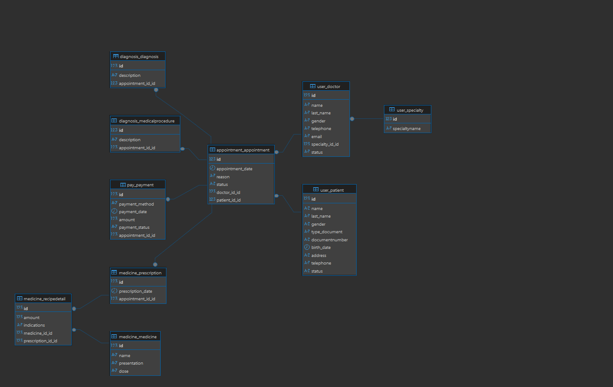

# 📘 SYSTEM DOCUMENTATION

## 1. Project Information

Project Name: **Clinica La Pampara – Clinical Management System**
Student Name:  **Edwin Jose Ceballos Ipuana**
Course:  **Databases II**
Semester: **7th Semester** 
Date:  **November 19, 2025**
Instructor:  **Jaider Quintero**

### Short Project Description
This project consists of a complete clinical management system developed using **Django REST Framework** (backend) and **Angular CLI 20.3.10** (frontend).  
The system manages patients, doctors, specialties, appointments, diagnoses, prescriptions, payments, medical procedures, and detailed recipe information.  
The application uses **MySQL** as the primary database engine.

---

## 2. System Architecture Overview

### 2.1 Architecture Description
The system follows a **client–server REST architecture**, where:

- The **backend** (Django REST Framework) exposes RESTful API endpoints.
- The **frontend** (Angular) consumes the endpoints and manages the user interface.
- The **MySQL database** stores all clinical information.

Data flows from the Angular frontend → API → Django backend → MySQL database.

### 2.2 Technologies Used

- **Frontend:** Angular CLI 20.3.10, TypeScript, HTML, CSS  
- **Backend:** Django, Django REST Framework  
- **Database Engine:** MySQL  
- **Additional Libraries / Tools:**  
  - HttpClient (Angular)  
  - Django ORM  
  - MySQL Connector 

### 2.3 Visual explanation of the system’s operation

           +-------------------+
           |     Angular UI    |
           |  (Frontend SPA)   |
           +---------+---------+
                     |
                     | HTTP Requests (CRUD)
                     |
           +---------v---------+
           |   Django REST     |
           |    Backend API    |
           +---------+---------+
                     |
                     | SQL Queries
                     |
          +----------v----------+
          |       MySQL         |
          |   Database Engine   |
          +---------------------+

---

## 3. Database Documentation (ENGLISH)

### 3.1 Database Description
The database of the clinical management system is designed to store and manage all operational information related to medical appointments, patients, doctors, payments, prescriptions, diagnoses and medical procedures.
It follows a relational structure to ensure data integrity, consistency and efficient querying.

The database organizes the system into the following main entities:

Patients – Stores demographic and personal information.

Doctors – Contains professional information and medical specialties.

Appointments – Registers all consultations between patients and doctors.

Diagnoses & Medical Procedures – Records the diagnostic details and procedures of each appointment.

Payments – Manages billing, payment methods, dates and statuses.

Prescriptions – Handles prescribed medicines and their dosage details.

Recipedetails – Links prescriptions with individual medicines.

Medicines – Stores drug information such as name, presentation and dose.

Specialties – Defines medical specialties for doctors.

This structure allows complete traceability of clinical activities and supports CRUD operations required by the system.

### 3.2 ERD – Entity Relationship Diagram


### 3.3 Logical Model
Describe each relationship between entities here.

### 3.4 Physical Model (Tables)

| Table | Column | Type | PK/FK | Description |
|-------|--------|------|-------|-------------|
| user_patient | id | int | PK | Unique patient identifier |
| user_patient | name | varchar | | Patient's first name |
| user_patient | last_name | varchar | | Patient's last name |
| user_patient | gender | varchar | | Patient's gender |
| user_patient | type_document | varchar | | Type of document (ID, passport, etc.) |
| user_patient | documentnumber | varchar | | Patient identification number |
| user_patient | birth_date | date | | Birth date |
| user_patient | telephone | varchar | | Contact phone |
| user_patient | status | tinyint | | Active/inactive |

| Table | Column | Type | PK/FK | Description |
|-------|--------|------|-------|-------------|
| user_doctor | id | int | PK | Unique doctor identifier |
| user_doctor | name | varchar | | First name |
| user_doctor | last_name | varchar | | Last name |
| user_doctor | gender | varchar | | Gender |
| user_doctor | telephone | varchar | | Phone number |
| user_doctor | email | varchar | | Professional email |
| user_doctor | specialty_id_id | int | FK | References user_specialty(id) |
| user_doctor | status | tinyint | | Active/inactive |

| Table | Column | Type | PK/FK | Description |
|-------|--------|------|-------|-------------|
| user_specialty | id | int | PK | Specialty identifier |
| user_specialty | specialtyname | varchar | | Medical specialty |

| Table | Column | Type | PK/FK | Description |
|-------|--------|------|-------|-------------|
| appointment_appointment | id | int | PK | Appointment identifier |
| appointment_appointment | appointment_date | datetime | | Date and time of the appointment |
| appointment_appointment | reason | varchar | | Reason for the visit |
| appointment_appointment | status | tinyint | | Appointment status |
| appointment_appointment | doctor_id_id | int | FK | References user_doctor(id) |
| appointment_appointment | patient_id_id | int | FK | References user_patient(id) |

| Table | Column | Type | PK/FK | Description |
|-------|--------|------|-------|-------------|
| diagnosis_diagnosis | id | int | PK | Diagnosis identifier |
| diagnosis_diagnosis | description | text | | Diagnosis description |
| diagnosis_diagnosis | appointment_id_id | int | FK | References appointment_appointment(id) |

| Table | Column | Type | PK/FK | Description |
|-------|--------|------|-------|-------------|
| diagnosis_medicalprocedure | id | int | PK | Procedure identifier |
| diagnosis_medicalprocedure | description | text | | Medical procedure description |
| diagnosis_medicalprocedure | appointment_id_id | int | FK | References appointment_appointment(id) |

| Table | Column | Type | PK/FK | Description |
|-------|--------|------|-------|-------------|
| pay_payment | id | int | PK | Payment identifier |
| pay_payment | payment_method | varchar | | Card, cash, etc. |
| pay_payment | payment_date | datetime | | Date of payment |
| pay_payment | amount | decimal | | Payment amount |
| pay_payment | payment_status | varchar | | Paid/Pending |
| pay_payment | appointment_id_id | int | FK | References appointment_appointment(id) |

| Table | Column | Type | PK/FK | Description |
|-------|--------|------|-------|-------------|
| medicine_medicine | id | int | PK | Medicine ID |
| medicine_medicine | name | varchar | | Medicine name |
| medicine_medicine | presentation | varchar | | Presentation (e.g., tablets) |
| medicine_medicine | dose | varchar | | Dosage |

| Table | Column | Type | PK/FK | Description |
|-------|--------|------|-------|-------------|
| medicine_prescription | id | int | PK | Prescription ID |
| medicine_prescription | prescription_date | datetime | | Date of prescription |
| medicine_prescription | appointment_id_id | int | FK | References appointment_appointment(id) |

| Table | Column | Type | PK/FK | Description |
|-------|--------|------|-------|-------------|
| medicine_recipedetail | id | int | PK | Prescription detail ID |
| medicine_recipedetail | amount | int | | Quantity prescribed |
| medicine_recipedetail | indications | text | | Instructions |
| medicine_recipedetail | medicine_id_id | int | FK | References medicine_medicine(id) |
| medicine_recipedetail | prescription_id_id | int | FK | References medicine_prescription(id) |

## 4. Use Cases – CRUD Patient

### 4.1 Use Case: Create Patient

**Actor**: System user (clinic administrative staff)
**Description**: Registers a new patient in the system.
**Preconditions**: The user must have access to the patient module.
**Postconditions**: A new patient record is stored in the database.

**Main Flow:**

The user selects “Add Patient”.

The system displays the patient registration form.

The user fills in personal and contact information.

The user submits the form.

The system validates the data.

The system creates the new patient record.

The system shows a confirmation message.

### 4.2 Use Case: Read Patient

**Actor**: System user
**Description**: Displays the complete list of registered patients.
**Preconditions**: The patient module must be accessible.
**Postconditions**: Patient information is displayed.

**Main Flow**:

The user selects “Patients”.

The system loads the list of patients.

The system displays details such as name, document number and status.

### 4.3 Use Case: Update Patient

**Actor**: System user
**Description**: Edits the information of an existing patient.
**Preconditions**: The patient must exist in the database.
**Postconditions**: The patient record is updated.

**Main Flow**:

The user selects a patient from the list.

The system loads the patient’s information.

The user edits the fields.

The user saves the changes.

The system validates and updates the record.

A confirmation message is shown.

### 4.4 Use Case: Delete Patient

**Actor**: System user
**Description**: Removes a patient record from the system.
**Preconditions**: The patient must exist.
**Postconditions**: The patient record is deleted or archived.

**Main Flow**:

The user chooses a patient.

The system asks for delete confirmation.

The user confirms.

The system deletes the record.

The system shows a success notification.


## 4.5 Use Case: CRUD Doctor

## 4.6 Use Case:  Create Doctor

**Actor**: Admin user
**Description**: Registers a new doctor with personal data and specialty.
**Preconditions**: Specialty must exist.
**Postconditions**: Doctor is saved.

**Main Flow**:

User selects “Add Doctor”.

Fills in required fields.

Selects specialty.

Saves.

System stores data.

## 4.7 Use Case:  Read Doctor

**Actor**: Admin user
**Description**: Shows all registered doctors.

**Main Flow**:

User clicks “Doctors”.

System loads and displays list.

## 4.8 Use Case:  Update Doctor

**Actor**: Admin user
**Description**: Updates doctor data.

**Main Flow**:

User selects a doctor.

Edits values.

Saves changes.

System updates the record.

## 4.9 Use Case:  Delete Doctor

**Actor**: Admin user
**Description**: Deletes a doctor record.

**Main Flow**:

User selects a doctor.

Confirms deletion.

System deletes the record.

## 5.0 Use Case: CRUD Appointment

## 5.1 Use Case:  Create Appointment

**Actor**: Admin or receptionist
**Description**: Creates a new appointment for a patient and doctor.

**Main Flow**:

User selects “Add Appointment”.

Chooses patient and doctor.

Sets date, time and reason.

Saves.

System registers appointment.

## 5.2 Use Case:  Read Appointment

**Actor**: Admin
**Description**: Displays all appointments.

## 5.3 Use Case:  Update Appointment

**Actor**: Admin
**Description**: Edits appointment data.

## 5.4 Use Case:  Delete Appointment

**Actor**: Admin
**Description**: Deletes an appointment.

## 5.5 Use Case: CRUD Diagnosis

## 5.6 Use Case: Create Diagnosis
**Actor**: Doctor
**Description**: Creates a diagnosis for a specific appointment.

## 5.7 Use Case: Read Diagnosis

**Actor**: Doctor
**Description**: Displays diagnosis by appointment.

## 5.8 Use Case: Update Diagnosis

**Actor**: Doctor
**Description**: Updates the diagnosis description.

## 5.9 Use Case: Delete Diagnosis

**Actor**: Doctor
**Description**: Deletes a diagnosis entry.

## 6.0 Use Case: CRUD Medical Procedure

## 6.1 Use Case: Create Medical Procedure

**Actor**: Doctor
**Description**: Registers a medical procedure.

## 6.2 Use Case: Read Medical Procedure

**Actor**: Doctor
**Description**: Displays procedures linked to an appointment.

## 6.3 Use Case: Update Medical Procedure

**Actor**: Doctor
**Description**: Edits the procedure description.

## 6.4 Use Case: Delete Medical Procedure

**Actor**: Doctor
**Description**: Deletes a procedure entry.

## 6.5 Use Case: CRUD Payment

## 6.6 Use Case: Create Payment

**Actor**: Administrative staff
**Description**: Registers payment for an appointment.

## 6.7 Use Case: Read Payment

**Actor**: Administrative staff
**Description**: View payment history.

## 6.8 Use Case: Update Payment

**Actor**: Administrative staff
**Description**: Updates payment status or method.

## 6.9 Use Case: Delete Payment

**Actor**: Administrative staff
**Description**: Deletes payment record.

## 7.0 Use Case: CRUD Medicine

## 7.1 Use Case: Create Medicine

**Actor**: Admin
**Description**: Adds a medicine to the catalog.

## 7.2 Use Case: Read Medicine

**Actor**: Admin / Doctor
**Description**: Shows available medicines.

## 7.3 Use Case: Update Medicine

**Actor**: Admin
**Description**: Edits medicine information.

## 7.4 Use Case: Delete Medicine

**Actor**: Admin
**Description**: Removes medicine from database.

## 7.5 Use Case: CRUD Prescription


## 7.6 Use Case: Create Prescription

**Actor**: Doctor
**Description**: Creates a prescription for an appointment.

## 7.7 Use Case: Read Prescription

**Actor**: Doctor
**Description**: Shows prescriptions by appointment.

## 7.8 Use Case: Update Prescription

**Actor**: Doctor
**Description**: Updates prescription date or details.

## 7.9 Use Case: Delete Prescription

**Actor**: Doctor
**Description**: Deletes a prescription.

## 8.0 Use Case: CRUD Recipedetail

## 8.1 Use Case: Create Recipedetail

**Actor**: Doctor
**Description**: Adds a medicine and indication to a prescription.

## 8.2 Use Case: Read Recipedetail

**Actor**: Doctor
**Description:** Shows all details of a prescription.

## 8.3 Use Case: Update Recipedetail

**Actor**: Doctor
**Description**: Edits the dosage, amount or indications.

## 8.4 Use Case: Delete Recipedetail

**Actor**: Doctor
**Description**: Removes a medicine from a prescription.

---

## 9. Backend Documentation

## 9.1 Backend Architecture

The backend of the Clinica La Pampara System is built using Django and Django REST Framework (DRF).
The architecture follows a modular, app-based structure, where each domain (users, appointments, diagnosis, medicine, payments) is encapsulated in its own app.

**DRF components used**:

**Models – define database tables

**Serializers – convert models ↔ JSON

**Views / ViewSets – handle the business logic

**URLs – map API endpoints

**Permissions – access control for ViewSets

**Querysets & Services – used for filtering and logic

This modular design improves scalability, maintenance, and API reusability.

**9.2 Backend Folder Structure
```markdown
backend/
│── siteclinica/
│   ├── settings.py
│   ├── urls.py
│   ├── wsgi.py
│   ├── asgi.py
│
│── myapps/
│   ├── appointment/
│   ├── diagnosis/
│   ├── medicine/
│   ├── pay/
│   ├── user/
│
│── manage.py


Each app contains:

myapp/
│── models.py
│── serializers.py
│── views.py or viewsets.py
│── urls_viewset.py
│── admin.py


##9.3 Models by Application

**User App = {Doctor, Patient, Specialty}

**Appointment App = {Appointment}

**Diagnosis App = {Diagnosis,MedicalProcedure}

**Medicine App = {Medicine, RecipeDetail, Prescription}

**Payment App = {Payment}

These correspond exactly to the tables in the ERD image you provided.

##9.4 URL Routing Structure

The main file siteclinica/urls.py includes all app endpoints under the /api/ prefix:

```typescript
urlpatterns = [
    path('admin/', admin.site.urls),
    path('api/', include('myapps.user.urls_viewset')),
    path('api/', include('myapps.appointment.urls_viewset')),
    path('api/', include('myapps.diagnosis.urls_viewset')),
    path('api/', include('myapps.medicine.urls_viewset')),
    path('api/', include('myapps.pay.urls_viewset')),
]


This means all API routes look like:

```typescript
/api/patient/
/api/doctor/
/api/specialty/
/api/appointment/
/api/diagnosis/
/api/medicalprocedure/
/api/medicine/
/api/recipedetail/
/api/prescription/
/api/payment/


Exact method mapping varies by ViewSet (GetAll, Create, Update, Delete).

## 9.5 API Documentation (REST Examples)
Example 1 – Create Patient

Endpoint:

POST /api/patient/


Purpose:
Creates a new patient record.

Example Request Body:

{
  "name": "Juan",
  "last_name": "Cotes",
  "gender": "M",
  "type_document": "CC",
  "documentnumber": "123456789",
  "birth_date": "1995-01-01",
  "address": "Street 123",
  "telephone": "3216549870",
  "status": true
}


Responses:

201 Created – Patient successfully created

400 Bad Request – Validation issues

Example 2 – List Appointments
GET /api/appointment/


Returns all appointments, including doctor and patient relations.

Example 3 – Create Payment
POST /api/payment/

{
  "payment_method": "Cash",
  "payment_date": "2025-11-20",
  "amount": 25000,
  "payment_status": true,
  "appointment_id": 5
}

Example 4 – Get Medicine List
GET /api/medicine/

Example 5 – Assign Diagnosis to Appointment
POST /api/diagnosis/

{
  "description": "Acute headache",
  "appointment_id": 12
}

## 9.6 Authentication

At this stage, no login system was implemented, so:

No JWT

No DRF login system

APIs are public / unprotected

This must be clarified in the documentation.
### 10. Frontend Documentation
The frontend of the Clinica La Pampara System was developed using Angular CLI v20.3.10, following a modular structure with separate components, services, models, and pages for each functional area of the system.

## 10.1 Technical Frontend Documentation
Framework Used

Angular CLI 20.3.10

PrimeNG (UI Components)

PrimeIcons

TypeScript

HTML / CSS

## 10.2 Project Folder Structure

This structure matches exactly what you showed in Visual Studio Code:


```markdown
frontend/
│── angular.json
│── package.json
│── tsconfig.json
│
│── src/
    │── main.ts
    │── index.html
    │── styles.css
    │
    │── app/
        │── app.component.ts
        │── app.component.html
        │── app.routes.ts
        │
        │── layout/
        │  ├── aside/
        │  ├── footer/
		│  ├── header/
		│   
        │── components/
        │    ├── appointment/
        │    ├── diagnosis/
        │    ├── doctor/
        │    ├── layout/
        │    ├── medicalprocedure/
        │    ├── medicine/
        │    ├── patient/
        │    ├── payment/
        │    ├── recipedetail/
        │    ├── prescription/
        │    ├── specialty/
        │
        │── services/
        │    ├── appointments.ts
        │    ├── diagnosis.ts
        │    ├── doctors.ts
        │    ├── medicalprocedures.ts
        │    ├── medicines.ts
        │    ├── patients.ts
        │    ├── payments.ts
        │    ├── prescriptions.ts
		│    ├── recipedetails.ts
		│    ├── specialty.ts
        │
        │── models/
        │    ├── appointments.ts
        │    ├── diagnosis.ts
        │    ├── doctors.ts
        │    ├── medicalprocedure.ts
        │    ├── medicines.ts
        │    ├── patients.ts
        │    ├── payment.ts
        │    ├── recipedetails.ts
        │    ├── prescriptions.ts
        │    ├── specialties.ts
		
---		
##10.3 Services (API Communication)

Each entity communicates with the backend Django API through a dedicated Angular service.

Example: Patient Service

```typescript
import { Injectable } from '@angular/core';
import { HttpClient } from '@angular/common/http';
import { Observable, BehaviorSubject, tap, catchError, throwError } from 'rxjs';
import { PatientI, PatientResponseI } from '../models/patients';

@Injectable({
  providedIn: 'root'
})
export class PatientService {
  private baseUrl = 'http://localhost:8000/api/patients';
  private patientSubject = new BehaviorSubject<PatientResponseI[]>([]);
  public patients$ = this.patientSubject.asObservable();

  constructor(private http: HttpClient) {}

  getAllPatients(): Observable<PatientResponseI[]> {
    return this.http.get<PatientResponseI[]>(`${this.baseUrl}/`) 
      .pipe(
        tap(patients => {
          console.log('Pacientes obtenidos (array directo):', patients);
          this.patientSubject.next(patients);
        }),
        catchError(error => {
          console.error(' Error fetching patients:', error);
          return throwError(() => error);
        })
      );
  }

  getPatientById(id: number): Observable<PatientResponseI> {
    return this.http.get<PatientResponseI>(`${this.baseUrl}/${id}/`)
      .pipe(
        catchError(error => {
          console.error('Error fetching patient:', error);
          return throwError(() => error);
        })
      );
  }

  createPatient(patient: PatientI): Observable<PatientResponseI> {
    return this.http.post<PatientResponseI>(`${this.baseUrl}/`, patient)
      .pipe(
        tap(response => {
          console.log('Patient created:', response);
          this.refreshPatients();
        }),
        catchError(error => {
          console.error('Error creating patient:', error);
          return throwError(() => error);
        })
      );
  }

  updatePatient(id: number, patient: Partial<PatientI>): Observable<PatientResponseI> {
    return this.http.put<PatientResponseI>(`${this.baseUrl}/${id}/`, patient)
      .pipe(
        tap(response => {
          console.log('Patient updated:', response);
          this.refreshPatients();
        }),
        catchError(error => {
          console.error('Error updating patient:', error);
          return throwError(() => error);
        })
      );
  }

All services follow this pattern.

## 10.3 Models (TypeScript Interfaces)

Models define the structure for each data type.

Example: Patient Model

```typescript
export interface PatientI {
  id?: number;
  name: string;
  last_name: string;
  gender: "M" | "F" | "O"; 
  type_document: "R.C" | "T.I" | "C.C" | "C.E" | "PAS";
  documentnumber: string;
  birth_date: string;
  address: string;
  telephone: string;
  status: "ACTIVE" | "INACTIVE";
}

export interface PatientResponseI {
  id?: number;
  name: string;
  last_name: string;
  gender: "M" | "F" | "O"; 
  type_document: "R.C" | "T.I" | "C.C" | "C.E" | "PAS"; 
  documentnumber: string;
  birth_date: string;
  address: string;
  telephone: string;
  status: "ACTIVE" | "INACTIVE";
}

export const DocumentTypeOptions = [
  { label: 'Registro Civil', value: 'R.C' },
  { label: 'Tarjeta de Identidad', value: 'T.I' },
  { label: 'Cédula de Ciudadanía', value: 'C.C' },
  { label: 'Cédula de Extranjería', value: 'C.E' },
  { label: 'Pasaporte', value: 'PAS' }
];

export const GenderOptions = [
  { label: 'Masculino', value: 'M' },
  { label: 'Femenino', value: 'F' },
  { label: 'Otros', value: 'O' }
];


Every entity (doctor, medicine, appointment, etc.) has its own model.

## 10.4 Components

Each component is responsible for:

Displaying data

Forms for creating/editing records

Listing items in tables (PrimeNG DataTable)

Navigation between modules

Example folders you have:

appointment/
diagnosis/
doctor/
medicalprocedure/
medicine/
patient/
payment/
recipedetail/
prescription/
specialty/


Each module has components like:

GetAll component

Create/Edit component

Delete component

## 10.5 Layout System

You implemented a main layout that contains:

Sidebar (PrimeNG)

Header with the text "Clínica La Pampara"

Routing outlet for content rendering

This ensures all pages share the same structure.

## 10.6 Visual Explanation of the System Operation

Insert screenshots such as:

## 1. Dashboard or Main Layout

(Show header + sidebar)

##2. Patient Module

Patient list

Create patient form

## 3. Doctor Module

Doctor list

Specialty assignment

## 4. Appointment Module

Appointment scheduling

## 5. Diagnosis & Medical Procedures

Add diagnostic to appointment

## 6. Medicine & Prescription

Add prescription with recipe details

## 7. Payment System

Register a payment linked to an appointment

For each screenshot, include a short description:

Figure X. Patient Module Interface
This section allows creating, listing, and editing patient records.

## 11. Frontend–Backend Integration

Angular communicates with Django REST API through:

# 1. HTTPClient

Used in all services:

this.http.get('http://localhost:8000/api/patients/')

# 2. JSON Serialization

Django returns JSON automatically through DRF serializers.
Angular models map these responses.

# 3. Routing Match

Example:

Angular calls: /api/patients/

Django exposes: /api/patients/

This ensures full compatibility.

# 4. CORS Handling

You enabled API access from Angular (localhost:4200).

## 12. Conclusions & Recommendations

To complete your documentation, you can add points like:

The system successfully integrates Django REST + Angular.

Modular structure makes maintenance easier.

The absence of authentication makes the demo simpler, but security should be added later.

The database is normalized and matches real clinic workflow.

Frontend provides a clean interface for CRUD operations.

---
